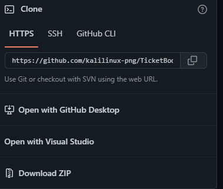

# Ticket Booking System

This project Is A Simulation of Ticket Booking System Used In Real World Movie Ticket Booking

## Installation

1. Install Python 3.0+
2. Install Git (*Optional) Or Download Zip File
   For Git Run Command :
   `git clone https://github.com/kalilinux-png/TicketBookingBackend.git`

   To Download Zip File

   2.1 Press The Green Button ---->:👇

   

   2.2 Then Hit Download Zip :--->:⬇

   
3. Unzip The Folder
4. Run The File Setup.py by double clicking the file

   Facing Issue In Installation :

   Feel Free To Create An Issue

Developers  Contact :

[Shubham yadav LinkedIn](https://www.linkedin.com/in/shubham-yadav-85194b203/)

[shubham yadav Github](https://github.com/kalilinux-png)

[Sushil Lodhi LinkedIn](https://www.linkedin.com/in/sushil-lodhi-653a4b208/)

[Sushil Lodhi Github](https://github.com/Sushil08102002)
